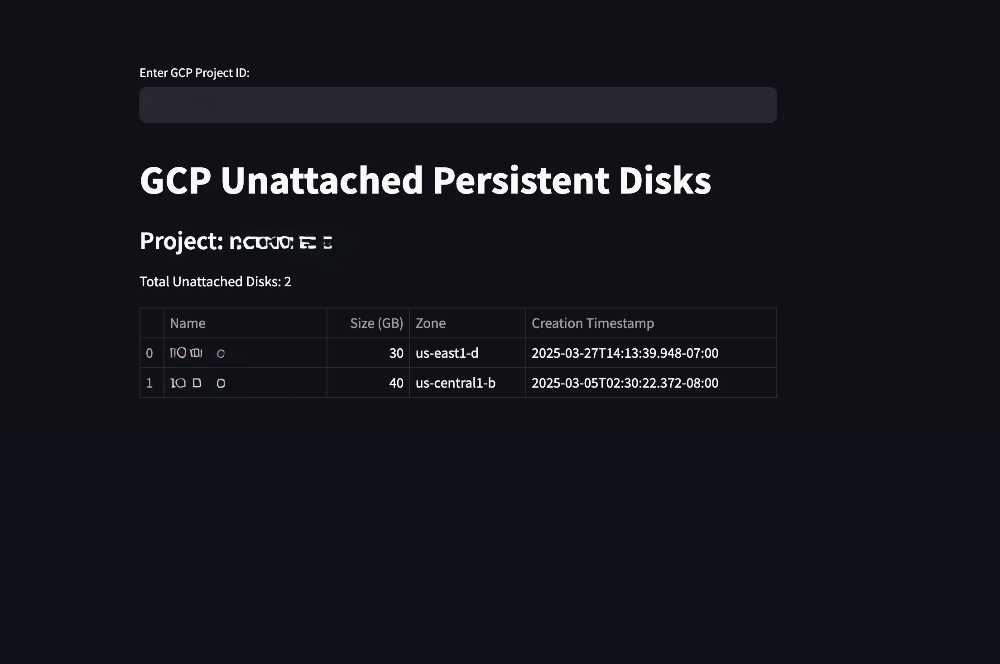

# 🚀 GCP Unattached Persistent Disks Cleanup

This project automates the identification of unattached persistent disks in Google Cloud Platform (GCP) and displays them on a sleek Streamlit dashboard. Optimize your GCP environment by identifying and managing unused disks efficiently.

---

## 🎮 Features
- Lists all unattached persistent disks in a specified project and zone
- Interactive Streamlit dashboard for real-time insights
- Simple input fields for Project ID and Zone
- Clean, responsive UI with detailed disk information

---

## 🛠 Prerequisites
- Python 3.9+
- Service Account with Compute Admin IAM Role
- Google Cloud SDK (gcloud) configured
- Streamlit and Google Cloud Libraries:
  ```bash
  pip install streamlit google-cloud-compute
  ```

---

## 🚀 Setup and Run
1. **Clone the Repository**
   ```bash
   git clone https://github.com/deepakkumar-m/Automation-Cleaning-Up-Unattached-Persistent-Disks-in-GCP.git
   cd Automation-Cleaning-Up-Unattached-Persistent-Disks-in-GCP
   ```

2. **Authenticate with GCP**
   ```bash
   gcloud auth application-default login
   ```

3. **Run the Dashboard**
   ```bash
   streamlit run detect_unused.py
   ```

---

## 🎉 Dashboard Preview


---

## 📜 License
MIT License. Feel free to use, modify, and distribute.
